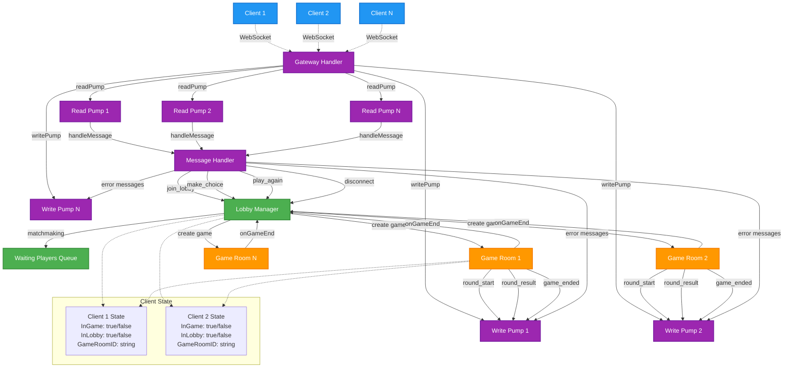
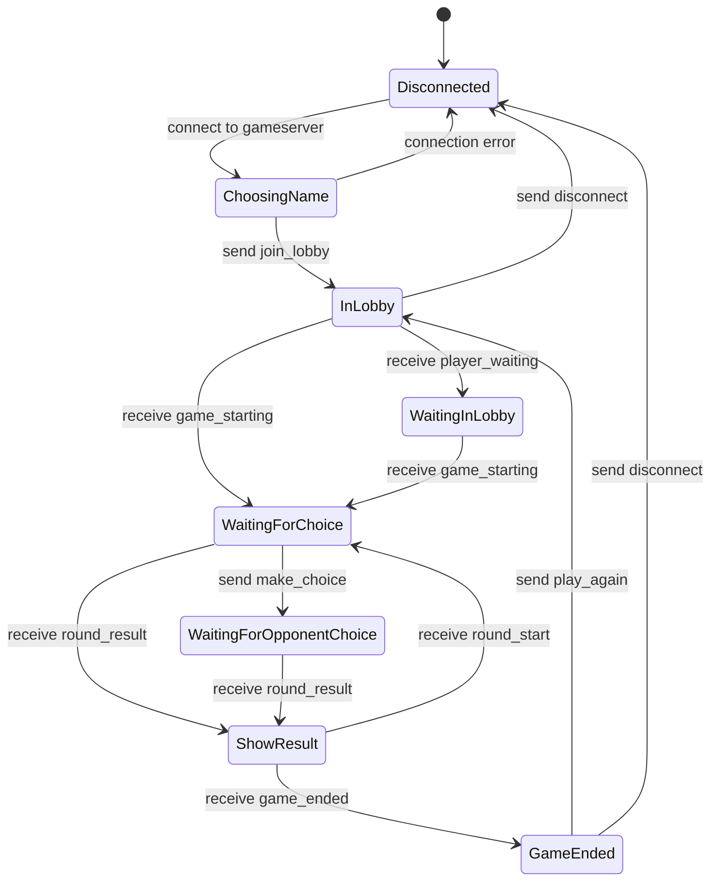

# Paper - Multiplayer Rock Paper Scissors

A real-time multiplayer Rock Paper Scissors game with Unity client and Go WebSocket server.

## Architecture

### Server Components (Go)
- **Gateway**: Manages client connections and message routing using pump-based architecture
- **Lobby**: Matches players and creates game rooms
- **Game Room**: Handles game logic and state management

#### Gateway Architecture
The Gateway uses a pump-based architecture for efficient bidirectional communication:

- **readPump**: Connection → Application
  - Continuously reads incoming messages from WebSocket connections
  - Handles message parsing and routing to appropriate handlers
  - Manages connection timeouts and ping/pong for connection health

- **writePump**: Application → Connection  
  - Continuously writes outgoing messages from internal channels to WebSocket
  - Handles message serialization and delivery
  - Manages write timeouts and connection cleanup

Each client connection runs two separate goroutines (readPump + writePump) for non-blocking, concurrent message processing. This pattern ensures that slow reads don't block writes and vice versa.

#### Server Architecture Flow



### Client (Unity)
- **Game UI**: Rock Paper Scissors interface
- **WebSocket Client**: Communication with game server
- **Game State Manager**: Client-side game state

## Game Flow

### Client State Machine


## WebSocket Message Protocol

### Client → Server Messages
- `join_lobby` - Join lobby with player name
- `make_choice` - Submit Rock/Paper/Scissors choice
- `play_again` - Return to lobby after game ends
- `disconnect` - Leave server

### Server → Client Messages  
- `player_waiting` - Waiting for opponent in lobby
- `game_starting` - Opponent found, entering game
- `round_result` - Round outcome (win/lose/draw) 
- `round_start` - Next round beginning
- `game_ended` - Final game result
- `error` - Error message

## Project Structure

```
/
├── gameserver/          # Go WebSocket server
│   ├── cmd/paperserver/ # Server executable
│   ├── internal/        # Server components
│   │   ├── lobby/       # Lobby management
│   │   ├── game/        # Game logic
│   │   └── gateway/     # Client gateway and WebSocket handling
│   └── go.mod
├── paper_client/        # Unity client
│   ├── Assets/
│   │   ├── Scripts/     # Game scripts
│   │   ├── Scenes/      # Unity scenes
│   │   └── UI/          # UI components
│   └── ...
└── README.md
```

## Development Setup

### Server
```bash
cd gameserver
go mod tidy
go run cmd/paperserver/main.go
```

### Client  
1. Open `paper_client` in Unity
2. Build and run or play in editor
3. Connect to `ws://localhost:8080/ws`

## Game Rules
- Best of 3 rounds wins
- Rock beats Scissors
- Scissors beats Paper  
- Paper beats Rock
- Same choice = Draw (replay round)