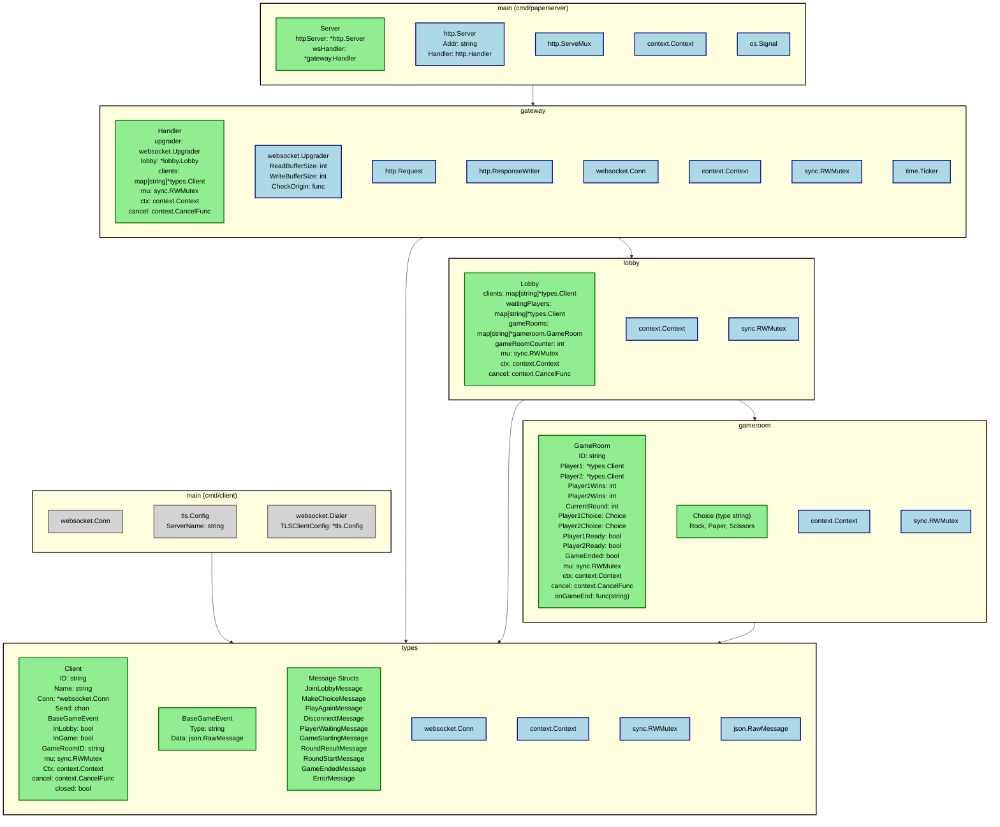
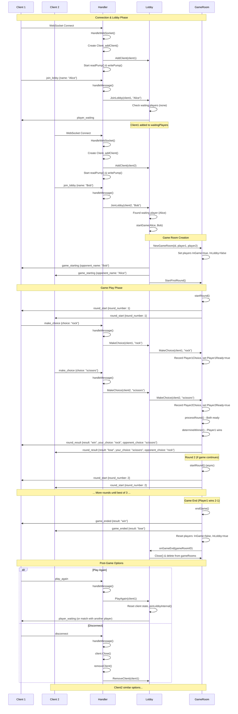
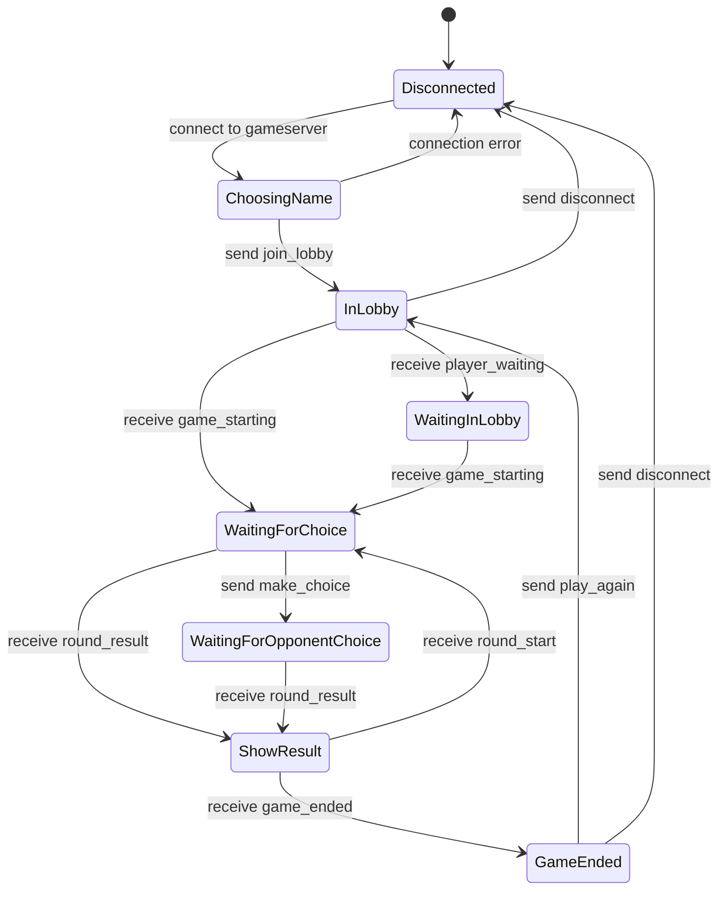
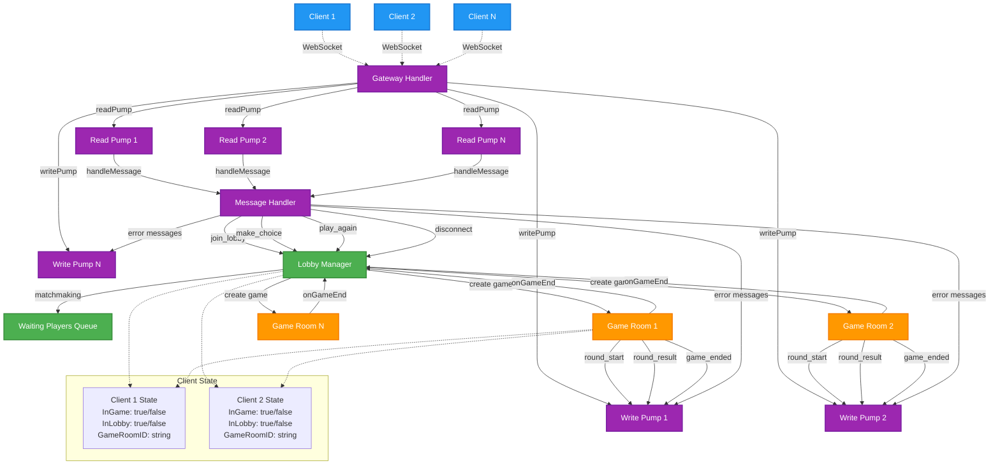

## Client Package Structure

| Package | Imports | Description |
|---------|---------|-------------|
| GameInitializer | Paper.UI.Core | Entry point component that creates and initializes the main GameUI system |
| Paper.Network | NativeWebSocket | WebSocket message protocol and GameServerClient for real-time server communication |
| Paper.UI.Core | Paper.Network, Paper.UI.Panels | Main UI coordinator managing canvas, event system, and panel transitions |
| Paper.UI.Panels | None | UI panels for login (LoginPanel) and game interaction (GamePanel) with button and text management |

## TODO

### * Re-Architect:
    in @gameserver/internal/gateway/handler.go - when the handler receives make_choice from the player this is passed to the lobby like lobby.MakeChoice() make a code review and evalutate if this architecture makes sense, because conceptually a lobby is for matching players and player moves should be handled by the game room, I would assume.
    
    Current Code: Works but violates clean architecture principles. The lobby acting as a message forwarder creates unnecessary coupling and doesn't align with its conceptual purpose.
    Better Approach: Gateway should route game messages directly to game rooms based on client state, keeping lobby focused on matchmaking only.


## Server Package Structure

| Package | Imports | Description |
|---------|---------|-------------|
| main (cmd/paperserver) | internal/gateway | HTTP server wrapper with WebSocket handler and graceful shutdown mechanism |
| main (cmd/client) | gorilla/websocket, internal/types | Command-line client for testing the game server with text-based interface |
| internal/types | gorilla/websocket | Message structures, client connection management, and WebSocket communication types |
| internal/gateway | gorilla/websocket, internal/lobby, internal/types | WebSocket connection handler with pump-based architecture for bidirectional communication |
| internal/lobby | internal/gameroom, internal/types | Player matchmaking, game room management, and client state transitions |
| internal/gameroom | internal/types | Rock Paper Scissors game logic and player interaction management |

## Server Structs Reference

| Package  | Name          | Methods                                                                                                                                                          | Source File                   | Purpose |
|----------|---------------|------------------------------------------------------------------------------------------------------------------------------------------------------------------|-------------------------------|---------|
| main     | Server        | Start, Shutdown                                                                                                                                                  | cmd/paperserver/main.go       | HTTP server wrapper with WebSocket handler for testing |
| types    | BaseGameEvent | _(no methods)_                                                                                                                                                   | internal/types/message.go     | Base structure for all WebSocket game events |
| types    | ErrorMessage  | _(no methods)_                                                                                                                                                   | internal/types/message.go     | Server message for error responses |
| types    | Client        | SetName, GetName, Close, IsClosed                                                                                                                                | internal/types/client.go      | WebSocket client connection with state management |
| gateway  | Handler       | HandleWebSocket, addClient, removeClient, readPump, writePump, handleMessage, Close                                                                              | internal/gateway/handler.go   | WebSocket connection manager and message router |
| lobby    | Lobby         | AddClient, RemoveClient, JoinLobby, startGame, sendPlayerWaiting, sendGameStarting, sendError, MakeChoice, PlayAgain, joinLobbyInternal, onGameEnd, Close        | internal/lobby/lobby.go       | Player matchmaking and game room management |
| gameroom | GameRoom      | StartFirstRound, MakeChoice, processRound, determineWinner, startRound, endGame, getClientByID, sendRoundResult, sendRoundStart, sendGameEnded, sendError, Close | internal/gameroom/gameroom.go | Rock Paper Scissors game logic and state |

## Server Package Structure Diagram



## Server Package Structure Diagram

## Complete Game Flow Sequence



# Paper - Multiplayer Rock Paper Scissors

A real-time multiplayer Rock Paper Scissors game with Unity client and Go WebSocket server.

## Prerequisites

### Unity Client Dependencies
**REQUIRED**: Install NativeWebSocket package in Unity:
1. Open Unity Package Manager (Window → Package Manager)
2. Click "+" → Add package from git URL
3. Enter: `https://github.com/endel/NativeWebSocket.git#upm`
4. Click "Add"

Without this package, the Unity client will not compile.

## Game Flow

### Client State Machine


## WebSocket Message Protocol

### Client → Server Messages
- `join_lobby` - Join lobby with player name
- `make_choice` - Submit Rock/Paper/Scissors choice
- `play_again` - Return to lobby after game ends
- `disconnect` - Leave server

### Server → Client Messages  
- `player_waiting` - Waiting for opponent in lobby
- `game_starting` - Opponent found, entering game
- `round_result` - Round outcome (win/lose/draw) 
- `round_start` - Next round beginning
- `game_ended` - Final game result
- `error` - Error message

## Project Structure

```
/
├── gameserver/          # Go WebSocket server
│   ├── cmd/paperserver/ # Server executable
│   ├── internal/        # Server components
│   │   ├── lobby/       # Lobby management
│   │   ├── game/        # Game logic
│   │   └── gateway/     # Client gateway and WebSocket handling
│   └── go.mod
├── paper_client/        # Unity client
│   ├── Assets/
│   │   ├── Scripts/     # Game scripts
│   │   ├── Scenes/      # Unity scenes
│   │   └── UI/          # UI components
│   └── ...
└── README.md
```

## Development Setup

### Server
```bash
cd gameserver
go mod tidy
go run cmd/paperserver/main.go
```

### Client  
1. Open `paper_client` in Unity
2. Build and run or play in editor
3. Connect to `ws://localhost:8080/ws`

## Game Rules
- Best of 3 rounds wins
- Rock beats Scissors
- Scissors beats Paper  
- Paper beats Rock
- Same choice = Draw (replay round)


## Architecture

### Server Components (Go)
- **Gateway**: Manages client connections and message routing using pump-based architecture
- **Lobby**: Matches players and creates game rooms
- **Game Room**: Handles game logic and state management

#### Gateway Architecture
The Gateway uses a pump-based architecture for efficient bidirectional communication:

- **readPump**: Connection → Application
    - Continuously reads incoming messages from WebSocket connections
    - Handles message parsing and routing to appropriate handlers
    - Manages connection timeouts and ping/pong for connection health

- **writePump**: Application → Connection
    - Continuously writes outgoing messages from internal channels to WebSocket
    - Handles message serialization and delivery
    - Manages write timeouts and connection cleanup

Each client connection runs two separate goroutines (readPump + writePump) for non-blocking, concurrent message processing. This pattern ensures that slow reads don't block writes and vice versa.

#### Server Architecture Flow



### Client (Unity)
- **Game UI**: Rock Paper Scissors interface
- **WebSocket Client**: Communication with game server
- **Game State Manager**: Client-side game state